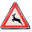

# **Traffic Sign Recognition** 

## Writeup

Here is a link to my [project code](https://github.com/udacity/CarND-Traffic-Sign-Classifier-Project/blob/master/Traffic_Sign_Classifier.ipynb)

### Data Set Summary & Exploration

#### 1. Provide a basic summary of the data set. In the code, the analysis should be done using python, numpy and/or pandas methods rather than hardcoding results manually.

I used the pandas library to calculate summary statistics of the traffic
signs data set:

Number of training examples = 4

Number of testing examples = 4

Image data shape = (32, 32, 3)

Number of classes = 43


### Design and Test a Model Architecture


As a first step, I decided to convert the images to grayscale because ...

Here is an example of a traffic sign image before and after grayscaling.


As a last step, I normalized the image data because it would create an image with zero mean


My initial model consisted of the following layers:
```
Layer                                          Description
Convolution Layer 1                            Layer from 32 X 32 X 1 --> 28 X 28 X 6
Activation Layer 1                             Relu activation
Pooling Layer 1                                Max pooling 28 X 28 X 6 --> 14 X 14 X 6
Convolution Layer 2                            Layer from 14 X 14 X 6 --> 10 X 10 X 16
Activation Layer 2                             Relu activation
Pooling Layer 2                                Max pooling 10 X 10 X 16 --> 5 X 5 X 6
Flatten Layer 1                                Flatten 5x5x16 --> 400
Fully Connected Layer 1                        Layer from 400 --> 120
Activation Layer 2                             Relu activation
Fully Connected Layer 2                        Layer from 120 --> 84
Activation Layer 3                             Relu activation
Fully Connected Layer 3                        Layer from 84 --> 43

```
This model gave me an accuracy of only 0.929. Because of this, I decided to add a dropout layer and another convolution layer to help increase accuracy. I also modified the epochs and batch size to the following:


EPOCHS = 100


BATCH_SIZE = 100


The drop out rate was set to 0.5.


So the finalized model is the following:
```
Layer                                          Description
Convolution Layer 1                            Layer from 32 X 32 X 1 --> 28 X 28 X 6
Activation Layer 1                             Relu activation
Pooling Layer 1                                Max pooling 28 X 28 X 6 --> 14 X 14 X 6
Convolution Layer 2                            Layer from 14 X 14 X 6 --> 10 X 10 X 16
Activation Layer 2                             Relu activation
Pooling Layer 2                                Max pooling 10 X 10 X 16 --> 5 X 5 X 6
Convolution Layer 3                            Layer from 14 X 14 X 6 --> 1 X 1 X 400
Activation Layer 3                             Relu activation
Pooling Layer 3                                Max pooling 1 X 1 X 400 --> 1 X 1 X 400
Flatten Layer 1                                Flatten 1 X 1 X 400 --> 400
Dropout Layer 1                                Droput wit prob = 0.5
Fully Connected Layer 1                        Layer from 400 --> 120
Activation Layer 3                             Relu activation
Dropout Layer 2                                Droput wit prob = 0.5
Fully Connected Layer 2                        Layer from 120 --> 84
Activation Layer 4                             Relu activation
Fully Connected Layer 3                        Layer from 84 --> 43
```

The final model has 2 dropout layers and one additional conolution layer. This gives an accuracy of 0.948

The learning rate is set to 0.0006


The initial accuracy was 0.929.This showed that my model was underfitted because I saw low accuracy on both training and validation set. I thought that adding another convolution layer would help but it did not exactly work in my favor. Then I decided to add two dropout layers which would help increase the accuracy


Final model statistics:


Validation Accuracy = 0.975
Train Accuracy = 1.000
Test Accuracy = 0.949


### Test a Model on New Images


Here are six German traffic signs that I found on the web:





I had to get bigger pictures and resize them, so I was not surprised when I did not get a 100 % accuracy

The results of the prediction are as follows:
```
Image:                                        Prediction:

AnimalCrossing                                AnimalCrossing
Right of Way                                  Right of Way
50 speed limit                                30 speed limit
Priority Road                                 Priority Road
No entry                                      No entry
Slippery Road                                 Slippery Road

```
Overall accuracy is at 0.83


The softmax for the images is given belw:

```
TopKV2(values=array([[  1.00000000e+00,   2.05589453e-37,   0.00000000e+00,
          0.00000000e+00,   0.00000000e+00],
       [  1.00000000e+00,   0.00000000e+00,   0.00000000e+00,
          0.00000000e+00,   0.00000000e+00],
       [  9.18842971e-01,   1.85018182e-02,   1.65516213e-02,
          1.26531962e-02,   8.90594721e-03],
       [  9.99670744e-01,   2.66555668e-04,   5.71551864e-05,
          4.90605362e-06,   3.87292346e-07],
       [  1.00000000e+00,   6.99090173e-17,   1.12527252e-18,
          3.45823292e-21,   9.02578045e-22],
       [  9.99971747e-01,   2.80115783e-05,   2.28508085e-07,
          1.03226061e-09,   6.00682698e-11]], dtype=float32), indices=array([[31,  5,  0,  1,  2],
       [11,  0,  1,  2,  3],
       [ 1, 21, 33,  0, 40],
       [12, 33, 13, 35,  3],
       [17, 14, 33, 34, 12],
       [23, 11, 30, 29,  3]], dtype=int32))
       
```
As you can see for the mis labelled image, the highest probability is that it is a 30 speed limit instead 50 which I attribute to the poor quality of the image.
